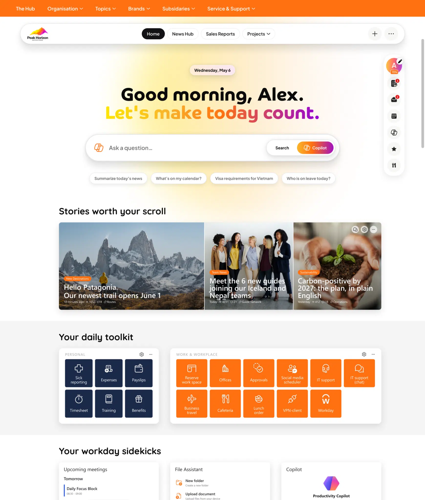

# About

This website provides information regarding releases of Bloom Intranet.

**Bloom Intranet is a personal digital workplace for SharePoint and Teams.**

{ .bloom-shot }

Bloom Intranet allows users to personalize their digital workplace in SharePoint or Microsoft Teams. It offers the user a canvas that can be filled with configurable widgets (blocks) that clearly display up-to-date and personalized information. This increases the productivity and involvement of employees in the organization.

Bloom Intranet comes in two products, and this website covers the releases of both:

- **Bloom Hub** — your all-in-one digital home base, with personalized boards, role-based templates and an extensive widget library.
- **Bloom Elements** — modular widgets that can be placed on any SharePoint page, standalone or as an extension of Bloom Hub.

Do you want to know more about Bloom Intranet? Contact us or visit our website at [bloomintranet.com](https://bloomintranet.com).

  
Try Bloom Intranet for free for 30 days and build the digital workplace your organization deserves.

  

    <a class="bloom-cta__button bloom-cta__button--primary" href="https://bloomintranet.com/install/">Try for free</a>
    <a class="bloom-cta__button bloom-cta__button--secondary" href="https://bloomintranet.com/demo/">Book a demo</a>
  

*This website was automagically generated using [mkdocs.org](https://www.mkdocs.org).*
